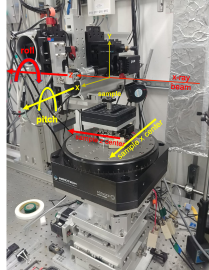

=====
align
=====

**align** is commad-line-interface to automatically determine the detector pixel size, to align focus, to align rotation axis tilt/pitch and to center the rotation axis in the middle of the detector field of view.  

**align** works in combination with a 0.5 mm `tungsten sphere <https://www.vxb.com/0-5mm-Tungsten-Carbide-One-0-0197-inch-Dia-p/0-5mmtungstenballs.htm>`_ that needs to be installed as a sample on top of the rotary stage making sure is in the field of view at least when the rotation axis is at 0 and 10 degrees.

Installation
============

::

    $ git clone https://github.com/xray-imaging/align.git
    $ cd align
    $ python setup.py install

in a prepared virtualenv or as root for system-wide installation.

Usage
=====

First step is to mesaure the image pixel size by running::

    $ align resolution

then yu can run the other adjustments with::

    $ align focus
    $ align center
    $ align roll
    $ align pitch

to list of all available options::

    $ align  -h

Configuration File
------------------

align parameters are stored in **align.conf**. You can create a template with::

    $ align init

**align.conf** is constantly updated to keep track of the last stored parameters, as initalized by **init** or modified by setting a new option value. 

Beamline customization
======================

To run **align** on a different beamline you need to change the EPICS pv names associated to your instrument. This can be done at run time by setting::

    --focus-pv-name FOCUS_PV_NAME
                        focus pv name (default: 2bma:m41)
    --image-pixel-size-pv-name IMAGE_PIXEL_SIZE_PV_NAME
                image pixel sizef pv name (default:
                2bma:TomoScan:ImagePixelSize)
    --rotation-pv-name ROTATION_PV_NAME
                rotation pv name (default: 2bma:m82)
    --sample-pitch-pv-name SAMPLE_PITCH_PV_NAME
                sample pitch pv name (default: 2bma:m50)
    --sample-roll-pv-name SAMPLE_ROLL_PV_NAME
                sample roll pv name (default: 2bma:m51)
    --sample-x-center-pv-name SAMPLE_X_CENTER_PV_NAME
                sample x center pv name (default: 2bmS1:m2)
    --sample-x-pv-name SAMPLE_X_PV_NAME
                sample x pv name (default: 2bma:m49)
    --sample-y-pv-name SAMPLE_Y_PV_NAME
                sample y pv name (default: 2bma:m20)
    --sample-z-center-pv-name SAMPLE_Z_CENTER_PV_NAME
                sample z center pv name (default: 2bmS1:m1)
    --shutter-close-pv-name SHUTTER_CLOSE_PV_NAME
                shutter close pv name (default: 2bma:A_shutter:close)
    --shutter-open-pv-name SHUTTER_OPEN_PV_NAME
                shutter open pv name (default: 2bma:A_shutter:open)
    --shutter-status-pv-name SHUTTER_STATUS_PV_NAME
                shutter status pv name (default:
            PA:02BM:STA_A_FES_OPEN_PL)
    --shutter-close-value SHUTTER_CLOSE_VALUE
                value to set the shutter-close-pv-name to close the
                shutter (default: 1)
    --shutter-open-value SHUTTER_OPEN_VALUE
                value to set the shutter-open-pv-name to open the
                shutter (default: 1)
    --shutter-status-close-value SHUTTER_STATUS_CLOSE_VALUE
                shutter close status value (default: 0)
    --shutter-status-open-value SHUTTER_STATUS_OPEN_VALUE
                shutter open status value (default: 1)
    --detector-prefix DETECTOR_PREFIX

or by changing the default pv_name values in the align/config.py file.
