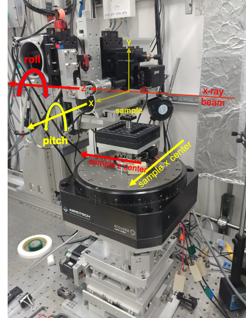

=====
align
=====

**align** is a command-line tool that automatically determines the detector pixel size, aligns the rotation axis tilt and pitch, and centers the rotation axis within the detector’s field of view.

**align** works with a regular sample mounted on top of the rotary stage, keeping it within the field of view at 0° and 180°. Three commands are available:

- ``align resolution`` — measures the detector pixel size.
- ``align rotation`` — single-pass measurement of the rotation axis position; prompts the operator to apply the correction.
- ``align auto`` — fully automated 4-step sequence: camera rotation → roll → pitch → sample X centering, with a built-in calibration pass to determine motor sensitivities.

Installation
============

::

    $ git clone https://github.com/xray-imaging/align.git
    $ cd align
    $ pip install .

in a prepared conda environment.

Usage
=====

.. note::

   **Prerequisite:** Before running any alignment command, the DMagic step must be completed to
   set the correct sample IN and OUT positions for the current sample/lens geometry. If the sample
   does not fully clear the beam during flat-field acquisition, ``align resolution`` will return
   ``inf μm/pixel`` and downstream alignment will be unreliable.

The first step is to measure the image pixel size. Install the test sample on the rotary stage and select a lens (for example, 10×). Next, determine the X position where the sample moves out of the field of view (for instance, –7). This position will be used to acquire a white-field image, while the in-position (e.g., 0) corresponds to the sample in the field of view. Both images are required because align operates on normalized images.

The pixel size is determined by acquiring two images: one at sample X = 0 mm and another at sample X = 0.1 mm, then measuring the horizontal shift between the two images. In the example below we use a 10x objective with a FLIR model Oryx ORX-10G-310S9M. The measured pixel size is 0.340472 μm/pixel.

Then, run the following command::

    (ops) 2bmb@arcturus$ align resolution --sample-in-x 0 --sample-out-x -7
    2025-10-22 10:15:21,333 - Saving log at /home/beams/2BMB/logs/adjust_2025-10-22_10_15_21.log
    2025-10-22 10:15:21,387 - Detector FLIR model Oryx ORX-10G-310S9M:
    2025-10-22 10:15:21,389 - *** The detector with EPICS IOC prefix 2bmSP2: and serial number 22150530 is on
    2025-10-22 10:15:21,389 -  
    2025-10-22 10:15:21,389 -   *** init FLIR camera
    2025-10-22 10:15:21,389 -   *** *** set detector to idle
    2025-10-22 10:15:21,399 -   *** *** set detector to idle:  Done
    2025-10-22 10:15:22,400 -   *** *** set trigger mode to Off
    2025-10-22 10:15:22,477 -   *** *** set trigger mode to Off: done
    2025-10-22 10:15:23,478 -   *** *** set image mode to single
    2025-10-22 10:15:23,519 -   *** *** set image mode to single: done
    2025-10-22 10:15:23,519 -   *** *** set cam display to 1
    2025-10-22 10:15:23,520 -   *** *** set cam display to 1: done
    2025-10-22 10:15:23,520 -   *** *** set cam acquire
    2025-10-22 10:15:23,706 -   *** *** set cam acquire: done
    2025-10-22 10:15:23,706 -   *** init FLIR camera: Done!
    2025-10-22 10:15:23,706 -  
    2025-10-22 10:15:23,706 -   *** setup FLIR camera
    2025-10-22 10:15:37,998 -   *** setup FLIR camera: Done!
    2025-10-22 10:15:38,000 -  
    2025-10-22 10:15:38,001 -   *** close_shutters
    2025-10-22 10:15:42,050 -   *** close_shutter: Done!
    2025-10-22 10:15:42,051 -   ***  *** acquire dark
    2025-10-22 10:15:42,051 -   ***  *** taking a single image
    2025-10-22 10:15:44,785 -  
    2025-10-22 10:15:44,785 -   *** open_shutters
    2025-10-22 10:15:46,039 -   *** open_shutter: Done!
    2025-10-22 10:15:46,039 - move_sample_out axis: horizontal
    2025-10-22 10:15:46,039 -       *** *** Move Sample X in at: -7.000000
    2025-10-22 10:15:53,391 -   ***  *** acquire white
    2025-10-22 10:15:53,392 -   ***  *** taking a single image
    2025-10-22 10:15:55,978 - move_sample_in axis: horizontal
    2025-10-22 10:15:55,978 -       *** *** Move Sample X in at: 0.000000
    2025-10-22 10:16:03,419 - Detector FLIR model Oryx ORX-10G-310S9M:
    2025-10-22 10:16:03,420 -  *** Find resolution ***
    2025-10-22 10:16:03,421 -   *** First image at X: 0.000000 mm
    2025-10-22 10:16:03,421 -   *** acquire first image
    2025-10-22 10:16:03,421 -   ***  *** taking a single image
    2025-10-22 10:16:06,099 -   ***  *** image size: [4852, 6464]
    2025-10-22 10:16:06,309 -   *** Second image at X: 0.100000 mm
    2025-10-22 10:16:06,802 -   *** acquire second image
    2025-10-22 10:16:06,802 -   ***  *** taking a single image
    2025-10-22 10:16:09,480 -   ***  *** image size: [4852, 6464]
    2025-10-22 10:16:09,679 -   *** moving X stage back to 0.000000 mm position
    2025-10-22 10:16:09,679 - move_sample_in axis: horizontal
    2025-10-22 10:16:09,679 -       *** *** Move Sample X in at: 0.000000
    2025-10-22 10:16:15,831 -   *** shift X: 293.709991, Y: -0.030000
    2025-10-22 10:16:15,832 -   *** found resolution 0.340472 μm/pixel

You can configure how the white-field images are collected by setting the --flat-field-axis option to horizontal, vertical, or both.

Once the pixel size has been measured, you can proceed to align the rotation axis with respect of the detector vertical pixel columns by using::

    (ops) 2bmb@arcturus$ align rotation

    2025-10-22 10:35:21,906 - Saving log at /home/beams/2BMB/logs/adjust_2025-10-22_10_35_21.log
    2025-10-22 10:35:21,967 - Detector FLIR model Oryx ORX-10G-310S9M:
    2025-10-22 10:35:21,968 - *** The detector with EPICS IOC prefix 2bmSP2: and serial number 22150530 is on
    2025-10-22 10:35:21,968 -  
    2025-10-22 10:35:21,968 -   *** init FLIR camera
    2025-10-22 10:35:21,968 -   *** *** set detector to idle
    2025-10-22 10:35:21,980 -   *** *** set detector to idle:  Done
    2025-10-22 10:35:22,980 -   *** *** set trigger mode to Off
    2025-10-22 10:35:23,051 -   *** *** set trigger mode to Off: done
    2025-10-22 10:35:24,051 -   *** *** set image mode to single
    2025-10-22 10:35:24,093 -   *** *** set image mode to single: done
    2025-10-22 10:35:24,093 -   *** *** set cam display to 1
    2025-10-22 10:35:24,093 -   *** *** set cam display to 1: done
    2025-10-22 10:35:24,093 -   *** *** set cam acquire
    2025-10-22 10:35:24,273 -   *** *** set cam acquire: done
    2025-10-22 10:35:24,273 -   *** init FLIR camera: Done!
    2025-10-22 10:35:24,273 -  
    2025-10-22 10:35:24,273 -   *** setup FLIR camera
    2025-10-22 10:35:38,585 -   *** setup FLIR camera: Done!
    2025-10-22 10:35:38,593 -  
    2025-10-22 10:35:38,593 -   *** close_shutters
    2025-10-22 10:35:42,169 -   *** close_shutter: Done!
    2025-10-22 10:35:42,169 -   ***  *** acquire dark
    2025-10-22 10:35:42,169 -   ***  *** taking a single image
    2025-10-22 10:35:44,873 -  
    2025-10-22 10:35:44,873 -   *** open_shutters
    2025-10-22 10:35:46,165 -   *** open_shutter: Done!
    2025-10-22 10:35:46,165 - move_sample_out axis: horizontal
    2025-10-22 10:35:46,166 -       *** *** Move Sample X in at: -7.000000
    2025-10-22 10:35:53,504 -   ***  *** acquire white
    2025-10-22 10:35:53,505 -   ***  *** taking a single image
    2025-10-22 10:35:56,143 - move_sample_in axis: horizontal
    2025-10-22 10:35:56,143 -       *** *** Move Sample X in at: 0.000000
    2025-10-22 10:36:03,472 -  
    2025-10-22 10:36:03,472 -   *** close_shutters
    2025-10-22 10:36:06,170 -   *** close_shutter: Done!
    2025-10-22 10:36:06,170 -   ***  *** acquire dark
    2025-10-22 10:36:06,170 -   ***  *** taking a single image
    2025-10-22 10:36:08,876 -  
    2025-10-22 10:36:08,876 -   *** open_shutters
    2025-10-22 10:36:10,151 -   *** open_shutter: Done!
    2025-10-22 10:36:10,151 - move_sample_out axis: horizontal
    2025-10-22 10:36:10,152 -       *** *** Move Sample X in at: -7.000000
    2025-10-22 10:36:17,461 -   ***  *** acquire white
    2025-10-22 10:36:17,461 -   ***  *** taking a single image
    2025-10-22 10:36:20,120 - move_sample_in axis: horizontal
    2025-10-22 10:36:20,120 -       *** *** Move Sample X in at: 0.000000
    2025-10-22 10:36:27,504 - Detector FLIR model Oryx ORX-10G-310S9M:
    2025-10-22 10:36:27,505 -  *** Aligning rotation ***
    2025-10-22 10:36:27,505 -   *** sample 0
    2025-10-22 10:36:27,506 -   ***  *** moving rotary stage to 0.000000 deg position ***
    2025-10-22 10:36:31,623 -   ***  *** acquire sample at 0.000000 deg position ***
    2025-10-22 10:36:31,624 -   ***  *** taking a single image
    2025-10-22 10:36:34,421 -   ***  *** image size: [4852, 6464]
    2025-10-22 10:36:34,612 -   *** sample 1
    2025-10-22 10:36:34,612 -   ***  *** moving rotary stage to 180.000000 deg position ***
    2025-10-22 10:36:38,665 -   ***  *** acquire sample at 180.000000 deg position ***
    2025-10-22 10:36:38,665 -   ***  *** taking a single image
    2025-10-22 10:36:41,378 -   ***  *** image size: [4852, 6464]
    2025-10-22 10:36:48,498 -   
    2025-10-22 10:36:48,498 -   *** rotation axis shift -3.415000 pixels ***
    2025-10-22 10:36:48,498 -   *** rotation axis shift -0.001162 mm ***
    2025-10-22 10:36:48,498 -   *** Additional values:  ***
    2025-10-22 10:36:48,498 -   *** rotation axis top    -2.955000 pixels ***
    2025-10-22 10:36:48,498 -   *** rotation axis center -3.590000 pixels ***
    2025-10-22 10:36:48,498 -   *** rotation axis bottom -3.430000 pixels ***
    2025-10-22 10:36:48,498 -   *** Move rotation axis to middle?
       *** Yes or No (Y/N):

This command acquires two images of the sample: one at 0° and another at 180°. It then analyzes these images to determine the position of the rotation axis at three points — the top, center, and bottom of the image — as well as the vertical (Y) shift, which is a measure of pitch.

The manual alignment procedure proceeds as follows:

1. **Camera rotation** — if ``top``, ``center``, and ``bottom`` differ, adjust the Optique Peter camera rotation motor until they are equal (tilt < 0.5 px).
2. **Roll** — move the hexapod Y axis to an elevated position (e.g., +5 mm), re-run ``align rotation``, then move to –5 mm and re-run. If the overall shift differs between the two Y positions, adjust the hexapod roll until they match.
3. **Pitch** — at the elevated Y position, adjust the hexapod pitch motor to zero the Y-component of the shift (``rotation axis shift Y``). Pitch is the tilt of the rotation axis along the beam (Z direction) and should be corrected last.

.. warning:: Make sure the hexapod X can still reach the white-field position when its Y is at the elevated/lowered location.

align auto
----------

``align auto`` runs all three steps above in sequence without manual iteration, using a built-in calibration pass to determine the sensitivity of each motor before applying corrections::

    (ops) 2bmb@arcturus$ align auto

    ...
    [auto] pixel size: 0.6905 um/px
    [auto] calibrating camera rotation sensitivity ...
    [auto] K_cam = 142.3 px/deg
    [auto] Roll/pitch steps require moving sample Y to +/-Y_ref.
    [auto] Default Y_ref = 5.0 mm. Hexapod nominal range: +/-10 mm (may be less).
    [auto] Larger Y_ref = higher sensitivity. Must stay within sample FOV.
      Enter Y_ref in mm [Enter = 5.0]:
    [auto] calibrating roll and pitch sensitivity at Y = 5.0 mm ...
    [auto] K_roll  = 99.2 px/deg at Y = 5.0 mm
    [auto] K_pitch = 7140.0 px/deg at Y = 5.0 mm
    [auto] === Step 1: Camera rotation convergence ===
    [auto] step 1 iter 1: tilt = +1.24 px
    [auto] step 1 iter 2: tilt = +0.08 px
    [auto] step 1 converged (tilt = +0.08 px < 0.5 px)
    [auto] === Step 2: Roll convergence at Y = ±5.0 mm ===
    [auto] step 2 iter 1: roll_error = +2.53 px
    [auto] step 2 iter 2: roll_error = +0.41 px
    [auto] step 2 converged (roll_error = +0.41 px < 2.0 px)
    [auto] re-checking camera rotation after roll adjustment ...
    [auto] === Step 3: Pitch convergence at Y = 5.0 mm ===
    [auto] step 3 iter 1: shift_y = +1.83 px
    [auto] step 3 iter 2: shift_y = -0.21 px
    [auto] step 3 converged (shift_y = -0.21 px < 1.0 px)
    [auto] === Step 4: Sample X centering ===
    [auto] step 4: centering sample X by +0.0021 mm (+3.0 px)
    [auto] === Alignment complete ===

The operator is prompted once to confirm the Y excursion range and verify the sample remains
in the field of view at both +Y_ref and –Y_ref before the roll/pitch steps begin.

``align auto`` requires that ``align resolution`` has been run at least once in the current
session (pixel size must be stored in ``align.conf``).

Key parameters for ``align auto`` (set in ``align.conf`` or on the command line):

+--------------------------+----------+----------------------------------------------------------+
| Parameter                | Default  | Description                                              |
+==========================+==========+==========================================================+
| ``--y-ref``              | 5.0 mm   | Hexapod Y excursion for roll/pitch calibration           |
+--------------------------+----------+----------------------------------------------------------+
| ``--tilt-threshold``     | 0.5 px   | Camera rotation convergence criterion                    |
+--------------------------+----------+----------------------------------------------------------+
| ``--shift-threshold``    | 2.0 px   | Roll convergence criterion                               |
+--------------------------+----------+----------------------------------------------------------+
| ``--pitch-threshold``    | 1.0 px   | Pitch convergence criterion                              |
+--------------------------+----------+----------------------------------------------------------+
| ``--max-iterations``     | 10       | Max iterations per step before aborting                  |
+--------------------------+----------+----------------------------------------------------------+
| ``--calibration-delta-cam`` | 0.05°  | Camera rotation test delta for sensitivity calibration  |
+--------------------------+----------+----------------------------------------------------------+
| ``--calibration-delta-roll`` | 0.02° | Roll test delta for sensitivity calibration             |
+--------------------------+----------+----------------------------------------------------------+
| ``--calibration-delta-pitch`` | 0.01° | Pitch test delta for sensitivity calibration           |
+--------------------------+----------+----------------------------------------------------------+

To list of all available options::

    $ align  -h
    usage: align [-h] [--config FILE] [--version]  ...

    options:
      -h, --help     show this help message and exit
      --config FILE  File name of configuration file
      --version      show program's version number and exit

    Commands:

        init         Create configuration file
        status       Show the align cli status
        resolution   Find the image resolution
        rotation     Align rotation axis
        auto         Automated 4-step alignment (camera rotation, roll, pitch, sample X)

Configuration File
------------------

align parameters are stored in **align.conf**. You can create a template with::

    $ align init

**align.conf** is constantly updated to keep track of the last stored parameters, as initalized by **init** or modified by setting a new option value. 

Beamline customization
======================

To run **align** on a different beamline you need to change the EPICS pv names associated to your instrument. This can be done at run time by setting::

    --focus-pv-name FOCUS_PV_NAME
                          focus motor pv name (default: 2bmb:m4)
    --rotation-pv-name ROTATION_PV_NAME
                          sample rotation motor pv name (default: 2bmb:m102)
    --sample-lamino-pv-name SAMPLE_LAMINO_PV_NAME
                          sample lamino motor pv name (default: 2bmb:m49)
    --sample-pitch-pv-name SAMPLE_PITCH_PV_NAME
                          sample pitch motor pv name (default: 2bmHXP:m5)
    --sample-roll-pv-name SAMPLE_ROLL_PV_NAME
                          sample roll motor pv name (default: 2bmHXP:m4)
    --sample-theta-pv-name SAMPLE_THETA_PV_NAME
                          sample theta motor pv name (default: 2bmHXP:m6)
    --sample-x-pv-name SAMPLE_X_PV_NAME
                          sample x motor pv name (default: 2bmHXP:m1)
    --sample-x-top-pv-name SAMPLE_X_TOP_PV_NAME
                          sample x center motor pv name (default: 2bmb:m17)
    --sample-y-pv-name SAMPLE_Y_PV_NAME
                          sample y motor pv name (default: 2bmHXP:m3)
    --sample-z-top-pv-name SAMPLE_Z_TOP_PV_NAME
                          sample z center rmotor pv name (default: 2bmb:m18)
    --shutter-close-pv-name SHUTTER_CLOSE_PV_NAME
                          shutter close pv name (default: 2bma:B_shutter:close)
    --shutter-open-pv-name SHUTTER_OPEN_PV_NAME
                          shutter open pv name (default: 2bma:B_shutter:open)
    --shutter-status-pv-name SHUTTER_STATUS_PV_NAME
                          shutter status pv name (default: PA:02BM:STA_B_SBS_OPEN_PL)
    --shutter-close-value SHUTTER_CLOSE_VALUE
                          value to set the shutter-close-pv-name to close the shutter (default: 1)
    --shutter-open-value SHUTTER_OPEN_VALUE
                          value to set the shutter-open-pv-name to open the shutter (default: 1)
    --shutter-status-close-value SHUTTER_STATUS_CLOSE_VALUE
                          shutter close status value (default: 0)
    --shutter-status-open-value SHUTTER_STATUS_OPEN_VALUE
                          shutter open status value (default: 1)
    --detector-prefix DETECTOR_PREFIX

or by changing the default pv_name values in the align/config.py file.
